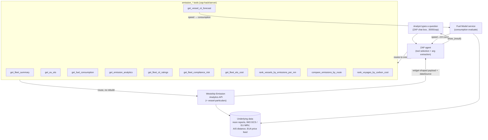

# Emission Analyst

**Your fleet's emissions and compliance desk, answered in chat.**
Ask a question in plain language — CII, EU ETS, fuel, FuelEU, voyage carbon cost — and get the right chart or card back in a single ZAP prompt. Built entirely on ZeroNorth's existing **Westship Emission Analytics API** and **Fuel Model service**, re-exposed as ZAP agent tools that render the [`zap-widgets` emission widgets](widgets/src/emission/) — vendored as a git submodule tracking `zap-widgets@zap-dev-wave`.

> Repo: <https://github.com/anakha-mt/emission-analyst/tree/main> · Team: **Emission Analyst** · Data source: **Stage** (`zn-stage`, tenant `westship`)

---

## TL;DR for judges

Emission Analyst is a **thin agent layer over services we already run in production**. The Westship Emission Analytics API already computes CII, EU ETS exposure, fuel consumption and voyage carbon cost; the Fuel Model service already predicts consumption as a function of speed. We didn't rebuild any of that — we wrapped each capability as a ZAP tool (an OpenAPI operation on a local tool server) and let the chat agent route a natural-language question to the right one, returning the same charts the dashboard renders, inline in the conversation.

**Prize positioning**

| Category | Why it fits |
| --- | --- |
| **Best Reuse** *(primary)* | 100% of the analytics come from existing endpoints — the Westship Emission Analytics API and the Fuel Model service. The hackathon work is the tool server (OpenAPI spec + projections), the routing prompts, and the emission widgets, not the math. |
| **Most Immediately Useful** | The 16 supported prompts are the literal questions a compliance/emissions analyst pulls dashboards for. An analyst can use it Monday morning with no training. |
| **Biggest Ambition** *(light touch)* | The CII speed forecast is prescriptive, not just descriptive: it tells the operator the speed to hold to land a target rating, by inverting the fuel model. |

**Honesty note up front:** this runs against **live Stage data** (`zn-stage` SSM secrets, tenant `westship`). Every handler is **always-200**: if the upstream is unreachable, returns a 403 (RBAC), or no operator token is present, the tool falls back to a demo fixture or an empty-but-valid payload and tags the response with `dataSource: "live" | "fixture" | "empty"` plus a `message` explaining the fallback. So the demo never hard-fails, and the response always tells you whether the figures are real.

---

## The real problem

A fleet emissions/compliance analyst spends their day answering a recurring set of questions across several dashboards and exports:

- Where does my fleet sit on CII right now, and who is about to slip a grade?
- What is this one vessel's story — its fuel, its EU ETS bill, its CII trajectory?
- If a vessel is heading for a D or E, what can we actually *do* about it this year?
- Which vessels are efficient, which are not, and which voyages are costing us the most in carbon?

The data already exists in the Westship Emission Analytics App. The friction is **navigation and context-switching**: each question means picking a dashboard, filtering to a vessel or a year, and reading a chart. Emission Analyst removes that friction by making the question itself the interface — you type it, the agent fetches it, the chart comes back in chat.

---

## How it works on ZAP

The conversation is the UI. A user types a question; the ZAP agent selects one Emission Analyst tool, extracts the arguments (`vesselId` / `imo` / `year` / `route`), calls the local tool server, and renders the returned widget. The domain is registered as `emission` (see [`zap/domain.yaml`](zap-hack/zap/domain.yaml)), so the agent sees each tool as `emission_<operationId>`.



The agent's job is narrow on purpose: understand the question, extract the arguments, call one tool, and render the result via `show_<widget>(result)`. All domain logic stays in the services we already trust; the tool server only **projects** raw upstream JSON into each widget's Zod-validated shape.

---

## Tool registry

Each tool is one OpenAPI operation on the tool server and maps a class of analyst question to an existing service call and a widget. The "Covers prompts" column ties back to the [example prompts](#example-chat-prompts).

### Single-vessel tools (`vesselId` = IMO + `year`, e.g. `9711834` / `2026`)

| Tool (`emission_…`) | What it does | Inputs | Renders widget | Covers prompts |
| --- | --- | --- | --- | --- |
| `get_fleet_summary` | One-vessel KPI card: characteristics, voyage performance, attained CII + 30-day trend, EU ETS exposure/cost, per-fuel CO₂ breakdown | `vesselId`, `year` | `emission_fleet_summary` | 1 |
| `get_eu_ets` | EU ETS (EUA) exposure, total EUA cost in EUR, coverage % for a compliance year | `vesselId`, `year` | `emission_eu_ets` | 2 |
| `get_fuel_consumption` | YTD fuel consumption by fuel type (VLSFO, MGO, HFO…) with each fuel's CO₂ factor + total CO₂ | `vesselId`, `year` | `emission_fuel_consumption` | 3 |
| `get_emission_analytics` | Attained-CII curve(s), A–E rating boundaries per year, correction-factors summary | `vesselId`, `year` | `emission_analytics` | 4 |
| `get_vessel_cii_forecast` | Attained-AER trajectory + A–E boundary bands + **speed→CII curve** (which grade each sailing speed yields) | `imo` *or* `vesselName` | `cii_forecast_chart` | 10 |

### Fleet tools (optional `year`, defaults to current)

| Tool (`emission_…`) | What it does | Renders widget | Covers prompts |
| --- | --- | --- | --- |
| `get_fleet_cii_ratings` | Per-grade A–E counts + %, D/E count up front, every vessel with its attained grade — the one tool for distribution **and** at-risk questions | `fleet-cii-rating` / `fleet-cii-at-risk` | 5, 6, 7, 8, 16 |
| `get_fleet_emissions_overview` | Fleet totals (CO₂, distance, fuel, avg kg CO₂/nm) + per-vessel breakdown sorted by tank-to-wake CO₂ | `fleet-emissions-overview` | — |
| `get_fleet_compliance_risk` | Per-vessel risk across CII / FuelEU / EU ETS / EEOI, classified High/Medium/Low with a "why flagged" reason list | `fleet-compliance-risk` | 16 |
| `get_fleet_ets_cost` | Fleet total EU ETS € + allowances to surrender, per-vessel breakdown by cost | `fleet-ets-cost` | — |
| `rank_vessels_by_emissions_per_nm` | Ranks vessels by tank-to-wake kg CO₂ per nm (least efficient first) | `fleet-emissions-rank` | 11, 12 |
| `get_cii_rating_distribution` | *(deprecated — prefer `get_fleet_cii_ratings`)* alternate A–E circles + proportion bar + vessel table | `cii-rating-distribution` | 5 |

### Voyage & route tools (optional `startDate` / `endDate` / `search`)

| Tool (`emission_…`) | What it does | Renders widget | Covers prompts |
| --- | --- | --- | --- |
| `get_voyage_overview` | Fleet voyages for a date range — vessel, route, completion, attained vs required CII, distance, fuel, CO₂ | `voyage-cii-rating` / `vessel-voyages` | — |
| `rank_voyages_by_carbon_cost` | Ranks voyages by EU ETS cost (most expensive first) | `voyage-carbon-cost` | 15 |
| `get_incomplete_voyages` | In-progress voyages, fuel-per-nm vs completed (flags short port-manoeuvring voyages via `isShort`) | `incomplete-voyages` | — |
| `list_fleet_routes` | Every route sailed (direction-agnostic), with voyage count, vessels, avg per-nm CO₂, `comparable` flag — **ask the user which route, then stop** | route list | 13 |
| `compare_emissions_by_route` | Per-nm CO₂ across vessels on **one named route**, with average, spread, best/worst vessel | `fleet-route-emissions` | 13, 14 |

---

## The logic, shown explicitly

We surface the formulas the services use so the output is explainable, not a black box. Reduction factors, phase-in percentages, and the EUA price are **reference/config values** read from the Westship service, not hard-coded claims.

### Attained CII (AER method)

```
Attained CII = total_CO2_grams / (DWT_capacity × total_distance_nm)      [gCO₂ / (dwt · nm)]
```

### Rating band (A–E)

```
Required CII(year) = Reference_CII(vessel_type, size) × (1 − Z(year))
rating_ratio       = Attained CII / Required CII(year)
```
`rating_ratio` is placed against the vessel-type-specific **dd-vectors** (d1–d4 boundaries from IMO MEPC guidance) to land an A–E grade. `Z(year)` is the annual reduction factor (reference trajectory: 5% / 7% / 9% / 11% for 2023–2026; later years per IMO). All of these are read from service config.

### EU ETS cost

```
ETS_cost = verified_CO2_tonnes × phase_in(year) × EUA_price
```
Phase-in for maritime (reference): 40% (2024), 70% (2025), 100% (2026+). `EUA_price` comes from the configured price feed.

### Emission intensity (efficiency ranking)

```
intensity = total_CO2 / total_distance_nm        # lower is better; rank ascending for "most efficient"
```

### CII speed forecast (the prescriptive bit)

`get_vessel_cii_forecast` resolves the vessel, pulls its draught from vessel-particulars, then runs a **speed sweep through the Fuel Model service** to build a speed→consumption curve. Consumption rises steeply with speed (roughly cube-law for displacement hulls), so:

```
1. Take the current-year + two-years-back CII snapshots (Westship) for the attained-AER tail.
2. For each candidate speed v in the remaining-year window:
     projected_consumption = FuelModel(imo, v, draught)
     projected_CO2         = projected_consumption × CF(fuel_type)   # CF = CO₂ emission factor
     projected_attained_CII = (YTD_CO2 + projected_CO2)
                              / (DWT × (YTD_distance + v × 24 × remaining_days))
3. Map each projected_attained_CII onto the A–E boundary bands for the year.
4. Return the trajectory + the full speed→CII curve so each speed shows its attainable grade.
```
Output reads as: *"Hold ≤ `<X>` kn for the rest of 2026 to keep `9711834` at a good CII grade."*

---

## Example chat prompts

These are the supported questions. Vessel IMO `9711834` and year `2026` are used throughout (vessel names are illustrative).

1. `Give me a fleet summary for vessel 9711834`
2. `Show EU ETS for vessel 9711834 in 2026`
3. `Show fuel consumption for vessel 9711834 in 2026`
4. `Show emission CII analytics for vessel 9711834 in 2026`
5. `What is the current CII rating distribution across my fleet?`
6. `How many of my vessels are rated D or E this year?`
7. `How many of my vessels are rated C?`
8. `Which vessels are at risk of CII downgrade?`
9. `Compare CII ratings to last year`
10. `Suggest a speed for IMO 9711834 to hold to keep CII at a good grade this year` *(forecast chart)*
11. `Rank vessels by emissions per nautical mile`
12. `Which vessel is the most fuel efficient?`
13. `Compare emissions across similar routes`
14. `Compare emissions between vessels on a route`
15. `Which voyage generated the highest carbon cost?`
16. `Which vessels are at compliance risk?`

---

## Setup & run

### Prerequisites
- **Node.js ≥ 24** (`zap-cli` requires it; `run.sh` pins it via `nvm use 24`)
- **AWS SSO** logged in for the `zn-stage` profile (Stage SSM secrets): `aws sso login --profile zn-stage`
- The **`zap-widgets` emission widgets** are vendored as a **git submodule** at `widgets/`, tracking `0north/zap-widgets` branch **`zap-dev-wave`** — no sibling checkout needed. Clone with `--recurse-submodules` (or run `git submodule update --init`); `run.sh` initialises it for you. The tool server imports the widget schemas from `../widgets/src/emission`, and `zap.config.mjs` points the platform at `../widgets`.
- The widget schemas' only runtime dependency is **`zod`**, declared in the repo-root `package.json` and installed with a root `npm install` (also run by `run.sh`), so Node resolves it from inside the submodule. *(To pull newer `zap-dev-wave` commits: `git submodule update --remote widgets`, then commit the moved pointer.)*

### Run (Stage)
```bash
git clone --recurse-submodules https://github.com/anakha-mt/emission-analyst.git
cd emission-analyst/zap-hack
npm install
./run.sh                       # tool server (:9001) + `zap serve` platform (:3000)
```
`run.sh` first ensures the `widgets` submodule is checked out (`git submodule update --init`) and installs the root `zod` dependency, then boots the Express tool server in the background, waits for it, and starts `zap serve` (which reads the OpenAPI spec once at startup). Then open <http://localhost:3000/zap> and ask any of the [example prompts](#example-chat-prompts).

```bash
zap lint http://localhost:9001/openapi.json   # validate the spec is agent-readable
```

> **Restart after spec/tool changes.** `zap serve` reads `/openapi.json` once at startup — restart it after editing anything under `server/`. Widget source hot-reloads.

---

## Repo structure

```
emission-analyst/
├── README.md                       # this file
├── .gitmodules                     # widgets -> 0north/zap-widgets @ zap-dev-wave
├── package.json                    # root manifest: provides zod for the widgets submodule schemas
├── widgets/                        # git submodule: 0north/zap-widgets, branch zap-dev-wave
│   └── src/emission/               # the rendered emission widgets (schemas + components)
└── zap-hack/                       # the Emission Analyst tool server + ZAP domain
    ├── run.sh                      # inits submodule + root zod, boots tool server (:9001) + `zap serve` (:3000)
    ├── zap.config.mjs              # environment: stage, tenant: westship, widgets: ../widgets
    ├── package.json
    ├── server/
    │   ├── index.ts                # Express tool server — routes + GET /openapi.json (always-200)
    │   ├── openapi.ts              # OpenAPI 3.0 spec (x-zap enabled), built from the widget schemas
    │   ├── westship.ts             # soft HTTP client: emission-analytics + vessel-particulars + fuel model
    │   ├── vessel-facts.ts         # the live-vs-fixture decision
    │   └── projections/            # raw upstream JSON -> each widget's Zod-validated shape
    │       ├── emission-analytics.ts
    │       ├── eu-ets.ts
    │       ├── fleet-summary.ts
    │       ├── fuel-consumption.ts
    │       ├── vessel-cii.ts       # fleet CII ratings / overview / compliance risk / ETS cost / rank
    │       ├── vessel-details.ts
    │       ├── voyages.ts          # overview / carbon-cost / incomplete / routes / route comparison
    │       └── cii-charts.ts       # rating distribution + speed→CII forecast
    └── zap/
        ├── domain.yaml             # domain id: emission, name: Emission Analyst
        ├── knowledge/              # ambient knowledge injected into the agent prompt
        └── evals/                  # eval suites (vitest)
```

---

## Tech stack

- **ZAP** — ZeroNorth Agentic Platform (chat-native agent + widgets), run locally via `zap serve`
- **Node.js / TypeScript** tool layer — Express (HTTP), **Zod** (widget schema validation), `tsx`
- **Westship Emission Analytics API** — existing ZeroNorth service (CII, EU ETS, fuel, voyage carbon cost, vessel particulars)
- **Fuel Model service** — existing ZeroNorth service (speed → consumption prediction)
- Charts/cards rendered via the **`zap-widgets` emission widgets** (`show_<widget>` render tools)

---

## What we learned building on ZAP

*(Developer-experience section — fill in honestly before submission; these are the kinds of points judges reward for candor.)*

- **Tool routing vs. argument extraction.** How reliably did the agent pull `vesselId`/`imo` and `year` out of free text like *"vessel 9711834 in 2026"*? Note where it got the IMO but missed the year, or vice versa: `<finding>`
- **Disambiguating overlapping tools.** Prompts 5/6/7/8/16 all hit `get_fleet_cii_ratings`. Did the agent pick the right tool + widget (`fleet-cii-rating` vs `fleet-cii-at-risk`) cleanly, or did it sometimes reach for the deprecated `get_cii_rating_distribution`? `<finding>`
- **The two-turn route comparison.** `list_fleet_routes` is prompted to present routes and STOP so the user chooses, before `compare_emissions_by_route` runs. Did the agent respect that and not pick a route itself? `<finding>`
- **Returning rich charts in chat.** What worked and what didn't handing ZAP a widget payload vs. a table — sizing, legends, the `show_<widget>(result)` render hop? `<finding>`
- **Reusing existing APIs.** What was easy vs. awkward about projecting Westship responses into the widget Zod schemas? Auth (forwarded operator token), the cross-package schema import, latency? `<finding>`
- **The forecast round-trip.** Chaining Fuel Model (speed sweep) → Westship CII inside one tool: any latency or error-handling surprises with the always-200 fallback? `<finding>`
- **What we wish ZAP had.** `<finding>`

---

## Roadmap

- Push beyond CII to a unified **FuelEU pooling** recommender (best surplus↔deficit partner within the fleet).
- Proactive alerts: agent pings the analyst when a vessel crosses a downgrade margin.
- "Explain this number" follow-ups so any card can be drilled into conversationally.
- Multi-vessel forecast: optimal fleet-wide speed plan under a combined CII + EU ETS cost objective.

---

## Scope & disclaimer

- Runs against **Stage** data; on any upstream miss (no token / 403 RBAC / unreachable) a tool returns a demo fixture or empty payload, tagged via `dataSource` — so figures may be illustrative. Check `dataSource` / `message` on each response.
- Regulatory parameters (CII reduction factors, EU ETS phase-in, EUA price) are **reference/config values** read from the service and should be confirmed against the live config before any operational use.
- This is a hackathon submission: the value is the agent layer and the reuse of existing services, not new emissions math.
- Nothing here is regulatory or compliance advice; it is an internal analyst aid.

Link to video recording - https://drive.google.com/drive/folders/1D1K74mKh0G53M2jVC2B6Jc6pb4RQZ2Uh
